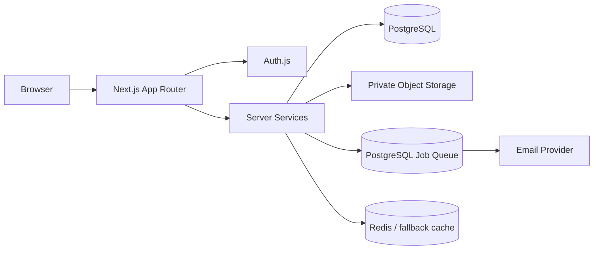

# Client File Delivery Portal

A self-hosted workspace for managing clients, projects, files, and secure digital deliveries.

> Built for teams that need a clear path from **client → project → files → delivery → download** without turning file handoff into a collection of scattered links and inbox threads.

[](./LICENSE)
[](https://nextjs.org/)
[](https://www.typescriptlang.org/)

## Table of Contents

- [Overview](#overview)
- [Features](#features)
- [How It Works](#how-it-works)
- [Architecture](#architecture)
- [Tech Stack](#tech-stack)
- [Project Structure](#project-structure)
- [Requirements](#requirements)
- [Quick Start](#quick-start)
- [Docker](#docker)
- [Environment Variables](#environment-variables)
- [Database](#database)
- [Storage](#storage)
- [Authentication](#authentication)
- [Projects and Files](#projects-and-files)
- [Deliveries](#deliveries)
- [Customer Portal](#customer-portal)
- [Notifications and Jobs](#notifications-and-jobs)
- [Security](#security)
- [Self-hosting and Production](#self-hosting-and-production)
- [Testing](#testing)
- [Documentation](#documentation)
- [Contributing](#contributing)
- [License](#license)

## Overview

Client File Delivery Portal is designed as a self-hosted application rather than a hosted SaaS product. A deployment owns its database, object storage, authentication configuration, email provider, and background worker.

The product has two main experiences:

- **Admin workspace:** customers, projects, files, deliveries, share links, notifications, activity, and settings.
- **Customer portal:** a focused space where customers can review projects, receive deliveries, download files, and manage their account.

The public delivery flow is intentionally separate from the authenticated workspace so a delivery link can present only the information required to receive a file package.

## Features

### Client management

Create and manage customer accounts, invitations, account states, and account security operations.

### Project and file management

Organize files by project and folder, inspect metadata, and keep the file workflow close to the project that owns it.

### Secure deliveries

Create delivery packages from project files, protect public links with expiration and optional password controls, and enforce download limits server-side.

### Customer portal

Customers get a separate, lower-density interface for projects, deliveries, notifications, and account settings.

### Authentication

Credentials authentication, optional Google sign-in configuration, one-time invitations, password reset, account state enforcement, and revocable sessions are supported by the current application architecture.

### Storage abstraction

Development can use local storage. Production can use S3-compatible object storage, including S3, R2, MinIO, and other compatible endpoints supported by the storage adapter.

### Background jobs and email

Durable PostgreSQL-backed jobs support retry and idempotency semantics. Email is provider-agnostic, with development and Resend-oriented infrastructure in the current codebase.

### Operational foundations

Health checks, structured logging, environment validation, security headers, rate-limit/cache foundations, Docker support, migrations, and backup/restore documentation are included.

## How It Works

```text
Admin
  │
  ├── Customer
  │     └── Invitation → Activation → Customer Portal
  │
  └── Project
        ├── Folders / Files
        └── Delivery
              └── Share Link → Public Delivery → Download
```

Typical admin workflow:

```text
Create customer
    ↓
Create project
    ↓
Upload and organize files
    ↓
Create delivery package
    ↓
Create share link
    ↓
Send link to customer
```

## Architecture



The application intentionally stays modular without splitting into microservices. Server-side services own authorization, validation, storage access, jobs, and domain workflows. The browser never becomes the source of truth for permissions.

See [`docs/architecture.md`](docs/architecture.md) for boundaries and data flow.

## Tech Stack

| Layer | Technology | Purpose |
| --- | --- | --- |
| Web | Next.js 16 | App Router, server rendering, route handlers |
| UI | React 19 | Interactive application UI |
| Language | TypeScript | Strict application code |
| Styling | Tailwind CSS | Responsive design system |
| Icons | Lucide React | Interface icons |
| Auth | Auth.js / next-auth | Sessions and providers |
| ORM | Prisma 7 | Database access and migrations |
| Database | PostgreSQL | Application persistence and jobs |
| Storage | S3-compatible API | Private object storage |
| Cache / rate limits | Redis | Distributed infrastructure when configured |
| Validation | Zod | Input validation |
| Password hashing | Argon2 | Password storage |
| Unit tests | Vitest | Fast automated tests |
| Browser tests | Playwright | End-to-end coverage |

## Project Structure

```text
.
├── src/
│   ├── app/                 # Routes, pages, route handlers
│   ├── components/          # Shared UI and layout components
│   ├── config/              # Product and navigation configuration
│   ├── lib/                 # Database, storage, utilities, infrastructure
│   ├── server/              # Server-side domain services and authorization
│   └── generated/           # Generated Prisma client
├── prisma/                  # Schema, migrations, seed
├── scripts/                 # Operational and worker scripts
├── docs/                    # Architecture, operations, security, design docs
├── .github/                 # CI and repository automation
├── Dockerfile
├── docker-compose.yml
└── package.json
```

## Requirements

Check the package files before upgrading the runtime versions. The current project targets:

- Node.js compatible with the installed Next.js 16 toolchain
- npm
- PostgreSQL
- Optional Redis for distributed rate limiting/cache
- Optional S3-compatible object storage for production
- Optional Resend configuration for production email

## Quick Start

```bash
git clone <repository-url>
cd client-file-delivery-portal
npm install
cp .env.example .env
npm run db:generate
npm run db:migrate
npm run db:seed
npm run dev
```

Open `http://localhost:3000`.

For a local infrastructure stack:

```bash
docker compose up -d
```

Run the durable worker separately when testing queued jobs:

```bash
npm run worker
```

Do not copy development credentials into production. The seed data is for local development and testing.

## Docker

The repository includes a production-oriented `Dockerfile` and a development `docker-compose.yml`.

```bash
docker compose up -d
```

Review the compose file and environment configuration before using it as a production deployment definition. Production should use private object storage, managed secrets, HTTPS, backups, and a separately managed database according to the deployment environment.

## Environment Variables

The complete safe template lives in [`.env.example`](.env.example). Important variables include:

| Variable | Required | Purpose |
| --- | --- | --- |
| `DATABASE_URL` | Yes | PostgreSQL connection string |
| `AUTH_SECRET` | Yes | Auth.js/session secret |
| `AUTH_URL` | Production | Canonical HTTPS application URL |
| `NEXT_PUBLIC_APP_NAME` | No | Replaceable product name |
| `STORAGE_PROVIDER` | No | `local`, `s3`, `r2`, `minio`, or `b2`-style configuration |
| `S3_ENDPOINT` | S3-compatible | Object storage endpoint |
| `S3_REGION` | S3-compatible | Storage region |
| `S3_BUCKET` | S3-compatible | Private bucket |
| `S3_ACCESS_KEY` | S3-compatible | Least-privilege access key |
| `S3_SECRET_KEY` | S3-compatible | Secret access key |
| `SIGNED_URL_EXPIRES_SECONDS` | No | Short signed download TTL |
| `REDIS_URL` | Recommended production | Distributed cache/rate-limit backend |
| `EMAIL_PROVIDER` | No | Development or production email provider |
| `EMAIL_FROM` | Resend | Verified sender |
| `RESEND_API_KEY` | Resend | Provider credential |

Never commit actual values from `.env`.

## Database

Development migrations:

```bash
npm run db:migrate
```

Production migrations:

```bash
npm run db:deploy
```

Seed development data:

```bash
npm run db:seed
```

The production workflow should use reviewed migrations and verified backups. Avoid destructive database reset commands against production databases.

## Storage

Development can use local storage. Production should use a private S3-compatible bucket.

The storage layer is responsible for:

- stable object keys
- server-side authorization
- private objects
- short-lived signed download URLs
- upload handling
- cleanup/error paths

See [`docs/storage.md`](docs/storage.md) for provider configuration and lifecycle details.

## Authentication

The account lifecycle is designed around:

```text
Invitation
   ↓
Activation
   ↓
Authenticated session
   ↓
Active / Suspended / Disabled
   ↓
Session revocation when account state changes
```

Password reset and invitation tokens are short-lived and stored as hashes where the implementation requires persistent security tokens.

Google sign-in is optional and should only be enabled when the provider credentials are configured for the deployment.

See [`docs/account-lifecycle.md`](docs/account-lifecycle.md) and [`docs/authentication.md`](docs/authentication.md).

## Projects and Files

Files belong to projects and can be organized into folders. Project access is authorized on the server. File metadata is kept separate from object storage so storage credentials and private object paths never become a browser-side authorization mechanism.

See [`docs/file-management.md`](docs/file-management.md).

## Deliveries

A delivery packages selected project files for a recipient. A share link can have an expiration date, optional password protection, and download limits.

The public flow is:

```text
/delivery/[token]
      ↓
Access checks
      ↓
Password verification when enabled
      ↓
Delivery contents
      ↓
Authorized download
```

Share tokens are not treated as reusable database identifiers, and download limits are enforced server-side.

See [`docs/delivery-system.md`](docs/delivery-system.md).

## Customer Portal

The customer experience intentionally uses a different density from the admin workspace. It focuses on projects, deliveries, notifications, and account security rather than exposing internal administration controls.

See [`docs/customer-portal.md`](docs/customer-portal.md).

## Notifications and Jobs

Notifications are persisted and scoped to authenticated users. Background jobs use PostgreSQL-backed durability and retry/idempotency semantics so important work does not depend on a browser remaining open.

See [`docs/notifications.md`](docs/notifications.md) and [`docs/jobs.md`](docs/jobs.md).

## Security

Security is a server-side responsibility. The project includes controls for:

- authentication and account-state checks
- role and object-level authorization
- Argon2 password hashing
- private object storage
- signed download URLs
- hashed invitation/reset/share tokens where applicable
- expiration and download limits
- rate limiting
- path traversal protection
- security response headers
- structured logging with sensitive-data boundaries

Before production use, perform an environment-specific review. Read [`SECURITY.md`](SECURITY.md) and [`docs/security.md`](docs/security.md).

## Self-hosting and Production

This project is intended to be self-hosted. It is not shipped as a hosted subscription service.

A production installation should provide:

1. HTTPS and a correctly configured reverse proxy.
2. PostgreSQL with tested backups.
3. Private object storage.
4. Strong application secrets managed outside source control.
5. A production email provider if invitation/reset email is enabled.
6. Redis when distributed rate limiting/cache is required by the deployment.
7. A worker process for durable jobs.
8. Health checks and operational monitoring appropriate to the host.

See [`docs/production.md`](docs/production.md), [`docs/deployment.md`](docs/deployment.md), and [`docs/production-checklist.md`](docs/production-checklist.md).

## Testing

Available quality commands:

```bash
npm run lint
npm run typecheck
npm run format:check
npm run test
npm run build
```

Playwright is included for browser-level testing. Run the configured Playwright suite when the required application and test infrastructure are available.

Test important negative paths as well as happy paths: unauthorized project access, expired links, suspended accounts, invalid uploads, session revocation, storage failures, and malformed user input.

## Documentation

- [`docs/architecture.md`](docs/architecture.md) — application architecture and boundaries
- [`docs/design-system.md`](docs/design-system.md) — visual language, tokens, accessibility, motion
- [`docs/authentication.md`](docs/authentication.md) — login and session lifecycle
- [`docs/authorization.md`](docs/authorization.md) — roles and object-level access
- [`docs/account-lifecycle.md`](docs/account-lifecycle.md) — invitations, activation, suspension, reset
- [`docs/customer-portal.md`](docs/customer-portal.md) — customer experience
- [`docs/file-management.md`](docs/file-management.md) — files and folders
- [`docs/delivery-system.md`](docs/delivery-system.md) — secure deliveries and links
- [`docs/storage.md`](docs/storage.md) — local and object storage
- [`docs/jobs.md`](docs/jobs.md) — durable background jobs
- [`docs/email.md`](docs/email.md) — email infrastructure
- [`docs/notifications.md`](docs/notifications.md) — notification behavior
- [`docs/deployment.md`](docs/deployment.md) — deployment topology
- [`docs/production.md`](docs/production.md) — production configuration
- [`docs/production-checklist.md`](docs/production-checklist.md) — deployment checklist
- [`docs/backup-and-restore.md`](docs/backup-and-restore.md) — recovery procedure
- [`docs/security.md`](docs/security.md) — security model and review notes
- [`docs/troubleshooting.md`](docs/troubleshooting.md) — common operational problems
- [`docs/testing.md`](docs/testing.md) — testing strategy
- [`docs/licensing.md`](docs/licensing.md) — license and third-party review
- [`docs/release-checklist.md`](docs/release-checklist.md) — release gate

## Contributing

Read [`CONTRIBUTING.md`](CONTRIBUTING.md) before opening a pull request. Security issues should follow [`SECURITY.md`](SECURITY.md) rather than a public issue.

## License

Client File Delivery Portal is released under the [MIT License](LICENSE). Third-party dependencies and assets may carry their own licenses and notices; review [`docs/licensing.md`](docs/licensing.md) when redistributing the project.
